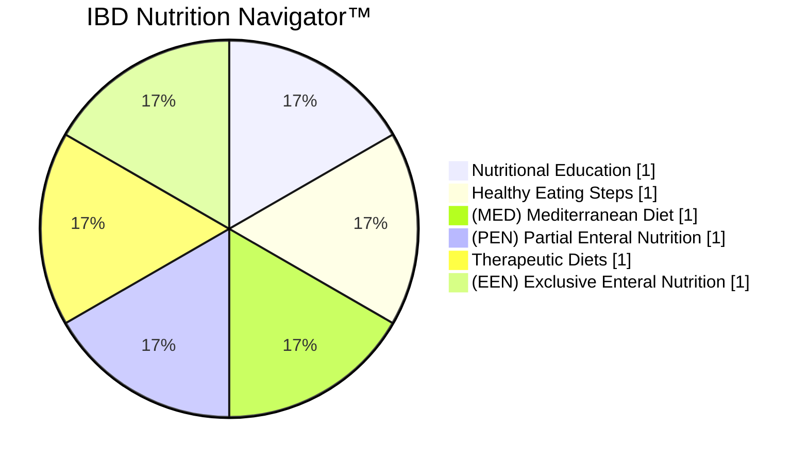

# The IBD Nutrition Navigator™

## A Patient-Centric Approach to Applying Evidence-Based Nutrition

IBD Nutrition Navigator™


Improve Overall Health & Wellness | Reduce Inflammation & Symptoms

NUTRITIONAL THERAPY for IBD

An option for every patient
---


# Acknowledgements

We express our deepest gratitude to everyone who contributed to the creation and development of the IBD Nutrition Navigator™, a resource designed to support healthcare providers and patients in leveraging current and evolving nutrition knowledge alongside medications to achieve optimal quality of life and health outcomes.

## Contributing Authors and Collaborators

| Medical Advisory Board:                                                                                                                                                                                          | Nutritional Therapy for IBD Staff                                                                      |
| ---------------------------------------------------------------------------------------------------------------------------------------------------------------------------------------------------------------- | ------------------------------------------------------------------------------------------------------ |
| Ashwin Ananthakrishnan, MD, MPH,FACG, AGAF<br/>Kimberly Braly, RDN, LDN, CNSC<br/>Kaylie Nguyen, MS, PNP<br/>Barbara Olendzski, RD,MPH, LDN<br/>Andrew S. Day, MB,ChB, MD, FRACP, AGAF<br/>Lindsey Albenberg, DO | Kim S. Beall, PharmD<br/>Vonda Zwick<br/>Raman Prasad, MSW<br/>David Gardinier, RD<br/>Nicole Wake, RD |


## Production and Design:

Technical development and design of online tool: Kvalifik ApS.

Branding and design: Maricich Health, with support of Raihaneh Bokharai

General production and technical support: Victorien Madsen

This resource has been made possible through an educational grant from Takeda Pharmaceuticals U.S.A., Inc., which facilitated the development of the IBD Nutrition Navigator™, the accompanying online tool, and this documentation.

Copyright© 2024 Nutritional Therapy for IBD

www.nutritionaltherapyforibd.org
---


# Table of Contents

## Introduction
4

## Steps to a Personalized Nutrition Approach
7

### Step 1: Assess Nutritional Status
7

### Step 2: Evaluate Disease State
9

### Step 3: Determine Goals
10

### Step 4: Consider Feasibility
12

### Step 5: Evaluate Dietary Options
20

## Clinical Considerations
32

### Primary vs Adjunctive Therapy
32

### Clinical Considerations for the Use of Exclusive Enteral Nutrition (EEN)
36

### Clinical Considerations for the Use of Therapeutic Diets
39

## Process for Assessing and Monitoring Nutritional Therapy
42

## Nutritional Adequacy of Dietary Therapy
44

## Options During Symptomatic Periods
46

## Tools for Identifying Trigger Foods and Safe Foods During Periods of Remission
47

## Conclusion
48

## References
49

## About Nutritional Therapy for IBD
57

IBD Nutrition Navigator™
An option for every patient
---


# The IBD Nutrition Navigator™

An option for every patient



## Introduction

Diet plays a pivotal role in the onset and progression of inflammatory bowel disease (IBD)¹, rendering it an essential modifiable factor in the course of the disease. Educating patients about the value of nutrition and providing evidence-based forms of nutritional therapy tailored to individual interests and needs are essential steps in equipping them with all of the available tools to improve their long-term outcomes. While ongoing research continues to expand our knowledge, it's imperative to implement current nutritional therapies to improve the lives of patients today. As described by Rizzelo et al.,

IBD Nutrition Navigator™
An option for every patient
---


"It is important not to underestimate the role diet can play in supporting conventional IBD therapies, not only helping to induce and maintain clinical remission, but above all, improving patient quality of life." ²

Discussing nutritional therapy with patients early on sets the stage for optimal long-term outcomes by empowering patients to engage as active partners in managing aspects of their condition. Central to this approach is shared decision-making grounded in an evaluation of patient nutrition status, interests and available resources. Recognizing that not all patients are receptive to dietary adjustments or prepared to implement changes at the same pace, it is imperative for nutrition planning to be a collaborative and fluid process between healthcare providers and patients.

As patient interest in integrating nutrition alongside medications grows, clinicians often seek guidance for its optimal use within medical practice. Although there are no formal guidelines, this algorithm shown on the next page, is grounded in research and clinical expertise, and provides an all-encompassing, personal approach to nutrition, with a menu of options to offer some level of benefit to every interested patient. Beginning with a user-friendly, step-by-step framework to guide healthcare professionals in discussing nutrition with their patients, this model concludes by addressing relevant clinical considerations influencing nutrition planning based on existing guidelines and evidence where available.

Visit Nutritional Therapy for IBD to access the IBD Nutrition Navigator with step-by-step guidance.
---


# IBD Nutrition Navigator™
An Option for Every Patient

```mermaid
graph TD
    A[Assess Nutritional Status] --> B[Evaluate Disease State]
    B --> C[Determine Goals]
    C --> D[Influence Disease Activity]
    C --> E[Improve Noninflammatory Symptoms]
    E --> F[When inflammation levels are low but GI symptoms persist; it may be related to food intolerances, irritable bowel syndrome IBS within IBD; other Disorders of Gut-Brain Interaction DGBI]
    D --> G[Improve IBD-Related and Overall Health]
    D --> H[Reduce Inflammation and Symptoms]
    H --> I[Maintenance]
    H --> J[Induction]
    G --> K[Healthy Eating Steps]
    G --> L[Mediterranean Diet]
    I --> M[Partial Enteral Nutrition]
    I --> N[Therapeutic Diet]
    J --> O[Therapeutic Diet]
    J --> P[Exclusive Enteral Nutrition]
    E --> Q[Minimize Trigger Foods]
    E --> R[Lactose- or Dairy-free and/or Gluten-free]
    E --> S[Low FODMAP]
    Q --> T[Identify trigger foods by elimination diet / food symptoms diary]
    K --> U[Food Additives, Processed Foods & Sugars | Whole Foods, Fruits & Vegetables]
    M --> V[35-50% of daily caloric intake]
    N --> W[SCD, IBD-AID, AIP, CDED]
    O --> W
    P --> X[6-12 weeks]
    S --> Y[4-6 weeks]
    {Q,R,S,K,L,M,N,O,P} --> Z[Consider Feasibility]
    Z --> AA[Assess Interest and Resources]
    AA --> AB[Use as Adjunctive Therapy]
    AA --> AC[Consider Primary vs. Adjunctive]
    AC --> AD[Only for Therapeutic Diets and EEN]
    AD --> AE[Use as Primary Therapy]
    AB --> AF[Minimize Trigger Foods, Lactose- or Dairy-free and/or Gluten-free; Low FODMAP, Healthy Eating Steps; Mediterranean Diet; PEN, Therapeutic Diet; EEN]
    AE --> AG[Only for Therapeutic Diets and EEN]
    {AB,AE} --> AH[During Symptomatic Periods]
    AH --> AI[Range of options, consider temporary use of EEN or PEN to reduce inflammation, safe foods, and/or options to improve noninflammatory GI symptoms]
```

NUTRITIONAL THERAPY for IBD

IBD Nutrition Navigator™
An option for every patient
---


# Steps to a Personalized Nutrition Approach


## Step 1: Assess Nutritional Status

Working in partnership with an IBD-trained dietitian when available, discussion topics should include the following:

- Assessing overall nutritional state, including screening for malnutrition. Read more about IBD and malnutrition.
- The person's relationship with food and potential for eating disorders
- Explanation of the potential for dietary changes to improve the underlying condition
- Education on nutritional therapy options based on the dietitian's nutrition assessment and the patient's disease state:
  - Healthy eating steps
  - Mediterranean diet (MED)
  - Partial enteral nutrition (PEN)
  - Exclusive enteral nutrition (EEN)
  - Therapeutic diets and
  - Options for improving Noninflammatory GI Symptoms

IBD Nutrition Navigator™  
An option for every patient
---


Refer the individual or caregiver to learn more from the resource links below:

- What is Nutritional Therapy
- Dietary Options
- Patients and Families Information and Support

IBD Nutrition Navigator™
An option for every patient
---


## Step 2: Evaluate Disease State

Disease state is an important consideration when evaluating the use of nutritional therapy. More details regarding its influence are discussed in the Clinical Considerations section. The evaluation includes:

- Type
  - Ulcerative colitis (UC)
  - Crohn's disease (CD)

- Location
  - Ileal
  - Colonic
  - Both ileal and colonic

- Severity of disease
  - Mild to moderate
  - Moderate to severe
  - Complicated disease (fistulas, abscesses, or strictures)
---


## Step 3: Determine Goals

Patients are more likely to be successful when they set their own goals for nutritional therapy, as a personal commitment to significant lifestyle changes is required for some dietary therapies.

This model provides three primary goals from which all nutrition options branch:

- Reduce Inflammation and Symptoms

This goal, targeting both inflammation and symptoms, requires the greatest commitment to dietary change. When a person has both the interest as well as the resources (social support, time, stable finances), nutritional options in this category range from using exclusive enteral nutrition (EEN) to therapeutic diets.

Induction Options:
- Exclusive enteral nutrition (EEN)
- Therapeutic Diet

Maintenance Options:
- Therapeutic Diet
- Partial enteral nutrition (PEN)
---


## Improve IBD Related and Overall Health

People choosing this goal would like to improve their overall health and quality of life. The nutritional options suggested here require less of a commitment than the previous goal. Dietary suggestions include taking healthy eating steps, such as reducing processed foods, adding in more fresh fruits and vegetables, to trying a Mediterranean diet. Over time, these dietary changes may reduce inflammation and symptoms, but the primary goal here is to feel better and improve quality of life long-term.

Options:
- Mediterranean Diet (MED)
- Healthy Eating Steps

## Improve Noninflammatory Symptoms

The goal here is to improve persistent GI symptoms like gas, pain, or bloating that may be present in otherwise quiescent disease. These symptoms may be related to a disorder of gut-brain interaction (DGBI), such as irritable bowel syndrome (IBS), or food intolerances that sometimes persist when disease is in remission or considered under control as supported by lab values and other testing, recognizing that low or subclinical levels of inflammation may be a contributing factor. These options vary from modest to high levels of commitment to dietary change.

Options:
- Low FODMAP Diet
- Lactose- or Dairy-free and/or Gluten-free
- Minimize Trigger Foods
---


## Step 4: Consider Feasibility

Assessing the feasibility of dietary changes is crucial in managing conditions like ulcerative colitis or Crohn's disease. This step involves evaluating a patient's interest in nutritional therapy and their available resources. By understanding these factors, healthcare providers can create realistic and effective dietary plans that fit the patient's lifestyle and support their treatment goals.

### Assess Interest

Evaluating a patient's interest in dietary changes is the first part of a two-step process to assess the feasibility of dietary change. Interest levels range from (5) enthusiastic to (1) low interest.

Note: When assessing interest in pediatric settings, the interest level of the parent(s)/caregiver(s), as well as the child with IBD, must be considered. If a child is old enough to engage in the discussion, their input is essential in evaluating interest level.

| **Enthusiastic** | **Enthusiastic (5):** Patient and/or caregivers are eager about nutritional therapy, understanding its importance in health and disease management, with a strong desire to implement it          |
| ---------------- | ------------------------------------------------------------------------------------------------------------------------------------------------------------------------------------------------- |
| **Interested**   | **Interested (4):** The patient is curious about the role of nutrition in their disease and is open to exploring dietary options.                                                                 |
| **Neutral**      | **Neutral (3):** The patient shows neither strong interest nor resistance and seeks professional guidance to understand the potential benefits of nutritional therapy to gather more information. |
| **Reluctant**    | **Reluctant (2):** The patient is hesitant but willing to review some dietary changes, often because they feel it is expected.                                                                    |
| **Low Interest** | **Low Interest (1):** The patient is unwilling or unable to make dietary changes, viewing it as an additional burden.                                                                             |


IBD Nutrition Navigator™
An option for every patient
---


# The "Stages of Change" model

The interest assessment is informed by the "Stages of Change" model, originally devised for addiction treatment. Ulcerative colitis or Crohn's disease often requires significant lifestyle and dietary adjustments for effective management. The Stages of Change model, comprising various phases of readiness and action towards change, provides a structured approach for patients and healthcare professionals to navigate these necessary dietary alterations. The first three stages of change roughly correspond to the "Assess Interest" choices as follows:

➢ Precontemplation Stage: "Low Interest" or "Reluctant"

In the Precontemplation stage, individuals with ulcerative colitis or Crohn's disease may not yet recognize the impact of diet on their condition. The focus here is on education and awareness – helping patients understand how certain foods can influence their disease activity. Healthcare providers can offer information about the potential benefits of dietary changes, such as reduced flare-ups and improved overall gut health, encouraging patients to consider the link between their diet and their disease.

➢ Contemplation Stage: "Neutral" or "Interested"

Moving into the Contemplation stage, patients start to acknowledge that their current dietary habits might be affecting their disease. They weigh the pros and cons of changing their diet, such as the effort involved in altering eating habits against the potential for symptom relief and better disease control. At this point, it's crucial to offer support and detailed information about how specific dietary changes can lead to improvement in their condition. Success stories or testimonials from other patients who have successfully managed their symptoms through diet
---


can be particularly motivating.

## Preparation Stage: "Enthusiastic"

In the Preparation stage, patients decide to take action. This stage involves planning and setting achievable dietary goals, with the help of a dietitian specializing in IBD. It's also a time for patients to learn about meal planning and preparation that aligns with their dietary needs, and to seek support systems, whether through healthcare providers, support groups, or family and friends.

## Action and Maintenance Stages

The Stages of Change model also includes Action and Maintenance stages, which don't map to the "interest" section. In these stages, patients actively engage in their new dietary regimen and work to sustain these changes over the long term. This could involve regular monitoring of symptoms and biochemical data to assess the impact of dietary changes, adapting and refining their diet as needed, and finding strategies to manage social and emotional challenges related to dietary restrictions. Continued support from healthcare providers, along with education about how to handle potential relapses or periods of increased disease activity, remains vital. Successfully navigating these stages can lead to a significant improvement in quality of life and disease management for patients with ulcerative colitis or Crohn's Disease.
---


## Consider Resources

The goal of this section is to better understand how a patient may be able to change their diet based on their current resources. There are many factors to consider, including a person's:

- Support Network
- Daily Schedule
- Ability to Cook
- Access to a Kitchen / Healthier foods
- Financial Security

### Support Network

Often, a strong support network can make a critical difference. As mentioned earlier, a patient may not know their way around the kitchen but may have friends or family who can help them get started. One patient who decided to start dietary changes shortly after an exhausting hospital stay had an uncle and aunt living close by who helped, including making soups as soon as she returned home. Over a period of weeks, she recovered enough strength to begin making meals with them, eventually taking over the process after having returned to work.
---


In contrast, a well-off, motivated couple wanted to use a therapeutic diet for their 10-year-old son who has Crohn's. The couple could afford the food, or to even hire someone to cook, and they also understood the underlying science. Unfortunately, they both had long commutes and work days. Also, having moved for their jobs, their local support network was weak in regards to family and close friends. As a result, they were not able to assist with the socio-emotional challenges their son would face in school. Although they were able to make healthier dietary adjustments for their son, using a therapeutic diet wasn't feasible at that point in time.

## Daily Schedule

A person's daily schedule is an important consideration. Many health dietary options are available but several take more time in terms of preparing food. Having a schedule that allows this time is an important consideration. With planning, many working people (often with the help of their support networks) have figured out routines that allow them to always have food available. This may include spending time over the weekend to bulk prepare food as a family. Recently, as healthy food options become more available, working people have been able to find meals that better fit their dietary needs at restaurants and supermarkets.

## Ability to Cook

Cooking skills are helpful, but motivation is key. Many people with little to no cooking experience have learned to prepare meals after being diagnosed with IBD and have shared their recipes online or in cookbooks. Learning to cook simple dishes and navigate the kitchen is empowering and grounding, as it involves physical activity. That said, patients shouldn't feel they have to rush into anything, especially if their energy level is low. The opportunity to prepare food is always
---


there. It helps to remind patients that want to "do everything they can" and "do it right now," that a combination of patience and slow, sustainable changes may be best.

## Access to a Kitchen / Healthier foods

Many of the dietary options for IBD require at least some kitchen access. In addition, whole foods can cost more. Fresh fruits and vegetables – which may be cooked, softened, or even blended for patients with active symptoms – may be harder to find and prepare than fast food. However, compared to only a few years ago, even healthier foods as well as many organic choices are more accessible and available at large, not-so-expensive stores. (In the U.S., Costco, Target and Walmart come to mind). Frozen or canned vegetables and dried legumes can offer further cost savings and may be less expensive than fast foods or pre-prepared meals. With dietician guidance and budgeting guidance on food selection, it is possible for many to increase their whole food intake.

## Financial Security

Up to 14% (1 out of 7) people with IBD in the U.S. are estimated to be food insecure. This often overlaps with overall financial distress and not being able to afford healthcare, including medication. It is important to recognize the context in which people live. If someone is experiencing financial insecurity, their overall stress levels will be much higher and it's important to have a social worker or other healthcare team member help them coordinate resources for overall IBD care.(Note: to encourage eating healthier foods, the U.S. government provides incentive programs and online resources for people using the Supplemental Nutrition Assistance Program, or SNAP.)
---


○ Social Determinants of Health

IBD patients are experts on their own lives in terms of understanding their motivation, energy level, social support system, daily schedule, finances, and countless other factors involved in day to day living. However, clinicians should be aware that for many people, social determinants of health may play an outsize role in their care. A study published in 2020 which used the U.S. National Health Interview Survey data from nearly 35,000 U.S. households found that for people with IBD:

● 1 in 7 experiences food insecurity
● 1 in 8 have both food insecurity and lack of social support
● They had 69% higher odds of food insecurity than people without IBD. (This is after controlling for age, sex, race, education, income, and insurance status.)
● Many skipped/used less medicine or delayed fulfilling subscriptions to save money
● Food insecurity led to more emergency department visits

In these cases, the priority is to address basic needs (food, shelter, medicine) while helping bolster the patient's social support system. It's important to have a social worker or other healthcare team members help coordinate resources for overall IBD care.
---


Once the above variables have been discussed with the patient, an assessment can be made about the level of the resources. We rate a patient's resources needed to implement nutritional therapy from 1 to 5.

Note: A pediatric setting differs from adult patients in that caregiver/parent resources/means are part of the assessment.

| Strong   | Strong (5):                                                                                                                                                                                                                   |
|----------|-------------------------------------------------------------------------------------------------------------------------------------------------------------------------------------------------------------------------------|
| Good     | The person with IBD and/or people in their support network enjoy cooking or have an interest in learning, have a flexible work/school schedule, have access to a kitchen/cooking supplies and proper foods, have available time to commit, and are financially secure. |
| Neutral  |                                                                                                                                                                                                                               |
| Weak     | Minimal (1):                                                                                                                                                                                                                  |
| Minimal  | A person with IBD who has a busy work/school schedule, little or no support, limited access to a kitchen/cooking supplies, frequent travel, high stress levels and/or budget restrictions may not be able to take on additional interventions. |

IBD Nutrition Navigator™
An option for every patient
---


## Step 5: Evaluate Dietary Options

Review the resulting dietary options at the intersection of the patient's current goals, interest level, and resources. The categories of nutritional options are summarized below, according to goals. These options should be further refined by relevant clinical considerations and other personal factors.

### Nutritional Options to Influence Disease Activity and Inflammation

Disease activity and inflammation may be most impacted by nutritional options listed under the goals Reduce Inflammation and Symptoms or Improve IBD-Related and Overall Health.

Note: Patients who are very symptomatic or who have strictures should begin whole-food-based diets carefully, working with an IBD-focused dietitian when available, as more advanced foods like raw vegetables may not be initially well tolerated. In this setting, it is best to begin with pureed, or peeled and cooked, soft vegetables. All therapeutic diets require or have optional phases/stages that guide the introduction of foods. Similar concepts may be applied to the Mediterranean Diet and Healthy Eating Steps.

### Goal: Reduce Inflammation and Symptoms

The options listed in this section may have the most substantial impact on inflammation and symptoms while requiring the most significant commitment to dietary change.
---


➢ Exclusive Enteral Nutrition

Exclusive enteral nutrition consists of using nutritionally complete liquid nutrition, without solid foods, for 6-12 weeks as primary or adjunctive therapy to induce remission or serve as a bridge to other therapies. It is widely utilized as first-line therapy for the induction of remission for pediatric CD as it is both safe and effective, achieving clinical remission in 80% of patients with superior mucosal healing to steroids.³⁻⁹ Added benefits include restored weight gain, growth, repletion of nutrients and nutritional status, and improvements in bone density, with little to no adverse effects.¹⁰,¹¹ For more detail regarding use in adults, complicated CD, and disease location, including UC, see Clinical Considerations Surrounding Use of EEN and Exclusive Enteral Nutrition.

| Exclusive Enteral Nutrition                                                                                                                                                      |                       |
| -------------------------------------------------------------------------------------------------------------------------------------------------------------------------------- | --------------------- |
| Exclusive enteral nutrition consists of using nutritionally complete liquid nutrition, without solid foods, for 6-12 weeks as primary or adjunctive therapy to induce remission. |                       |
| **Assessments:**                                                                                                                                                                 | Requires Commitment   |
| **Remission:**                                                                                                                                                                   | Induction             |
| **Therapy:**                                                                                                                                                                     | Primary or Adjunctive |

---


➢ Therapeutic Diets

Therapeutic diets (Specific Carbohydrate diet (SCD), IBD Anti-Inflammatory Diet (IBD-AID), Auto-Immune Protocol (AIP), Crohn's Disease Exclusion Diet (CDED)) are whole-food based, nutritionally balanced dietary plans that improve symptoms, reduce inflammation, and aid mucosal healing. These diets have been specifically designed to treat IBD or immune-mediated conditions. Items that may be inflammatory (processed foods and additives) are eliminated and items with potentially or unclear deleterious effects in IBD (gluten, sugar, and dairy) are either limited or removed, while the quantity and variety of beneficial whole foods are increased.

Therapeutic diets may be used as primary (for select patients) or adjunctive therapy to induce or maintain remission, or serve as bridge while awaiting insurance approval or effects of medication. For more details, see the section about Primary vs Adjunctive Therapy or visit Therapeutic diets to read more information and research.

| Therapeutic Diets                                                                                                                                                                                                                                                   |                                         |
| ------------------------------------------------------------------------------------------------------------------------------------------------------------------------------------------------------------------------------------------------------------------- | --------------------------------------- |
| Therapeutic diets (SCD, IBD-AID, AIP, CDED) are whole-food-based, nutritionally balanced dietary plans that improve symptoms, reduce inflammation, and aid in mucosal healing. These diets have been specifically designed with IBD or auto-immune disease in mind. |                                         |
| **Assessments:**                                                                                                                                                                                                                                                    | Requires High Level of Commitment       |
| Good/Strong Resources Helpful                                                                                                                                                                                                                                       |                                         |
| **Remission:**                                                                                                                                                                                                                                                      | Induction or Maintenance                |
| **Therapy:**                                                                                                                                                                                                                                                        | Primary for Select Patients, Adjunctive |

---


➢ Partial Enteral Nutrition

Partial enteral nutrition consists of the combination of nutritionally complete liquid nutrition and solid foods. Current recommendations suggest that 35%<sup>12,13</sup> to 50%<sup>14</sup> of daily caloric intake may be required for optimal efficacy. Partial enteral nutrition alone has not been shown to be effective in inducing remission.<sup>15</sup> Therefore, it is recommended only as adjunctive therapy in children and adults to maintain remission and improve inflammation and symptoms.<sup>3,6,12,13,15-22</sup> Partial enteral nutrition has been shown to prolong remission,<sup>23</sup> improve growth and nutrition,<sup>3</sup> and lower the rate of surgical recurrence.<sup>21</sup> For more detailed information visit Partial Enteral Nutrition (PEN))

<div style="border: 1px solid #ccc; padding: 10px; border-radius: 5px;">

## Partial Enteral Nutrition

Partial enteral nutrition (PEN) consists of the combination of nutritionally complete liquid nutrition and solid foods. Current recommendations describe 35-50% of daily caloric intake may be required for optimal efficacy.

### Assessments:
People with IBD who may not have the interest, time, or resources to include a therapeutic diet but are willing to include formula in their diet may select PEN as an adjunctive means to reduce inflammation and symptoms.

**Remission:** Maintenance
**Therapy:** Adjunctive

</div>
---


• Goal: Improve IBD-Related and Overall Health

The options listed here are designed to improve overall health and quality of life and require less commitment than the options listed in the previous goal. Over time, these dietary changes may reduce inflammation and symptoms, but the primary purpose is to feel better and improve quality of life.

➢ Mediterranean Diet

The Mediterranean Diet has shown health benefits in many disease states, including cardiovascular disease, cancer, and diabetes. The benefits are attributed to reductions in inflammation from higher consumption of vegetables, fruits, nuts, and healthful fats from avocados, fish, and olive oil.<sup>24,25</sup> It has been shown to provide improvement in IBD symptoms<sup>26</sup> and inflammation.<sup>27,28</sup> The Mediterranean Diet may be used as adjunctive therapy to improve overall health and symptoms.

| ### Mediterranean DietFor patients with IBD who prefer a choice that may be easier to follow than a therapeutic diet, the MED is a good choice for improving the condition of IBD and overall health. Read more about the Mediterranean Diet Assessments: Requires Commitment. People with IBD with an interest in a diet that reduces disease activity/inflammation while being less restrictive than Therapeutic Diets may favor this option. Remission: Maintenance Therapy: Adjunctive | See \[Mediterranean Diet] for an overview and current research in IBD. |
| ------------------------------------------------------------------------------------------------------------------------------------------------------------------------------------------------------------------------------------------------------------------------------------------------------------------------------------------------------------------------------------------------------------------------------------------------------------------------------------------ | ---------------------------------------------------------------------- |


IBD Nutrition Navigator™
An option for every patient
---


➢ Healthy Eating Steps

Healthy Eating Steps may be used as adjunctive therapy to improve overall health.
Healthy Eating Steps include the following:

- Avoid Food Additives* and Processed Foods
- Decrease Sugar
- Increase Whole Foods
- Increase Fruits and Vegetables

*Examples of food additives include maltodextrin, carrageenan, carboxymethylcellulose, polysorbate-80, titanium dioxide, and artificial sweeteners.

<div style="border: 1px solid #ccc; padding: 10px; margin: 10px 0;">

## Healthy Eating Steps

For those interested in improving their diet in a simple way, adoption of Healthy Eating Steps, either all at once, or one at a time when ready, can improve overall health and symptoms.

**Assessments:** Patients with an interest in eating healthy and alleviating IBD symptoms with fewer dietary changes may favor this option.

**Remission:** Maintenance

**Therapy:** Adjunctive

</div>
---


# Suggested Nutritional Therapy Options
to Impact Disease Activity and Inflammation

| Interest of Person with IBD | Interest of Person with IBD<br/>5 Enthusiastic                                                                                                       | Interest of Person with IBD<br/>4 Interested                                                                                                         | Interest of Person with IBD<br/>3 Neutral                                                                                                            | Interest of Person with IBD<br/>2 Reluctant                             | Interest of Person with IBD<br/>1 Low Interest                          |
| --------------------------- | ---------------------------------------------------------------------------------------------------------------------------------------------------- | ---------------------------------------------------------------------------------------------------------------------------------------------------- | ---------------------------------------------------------------------------------------------------------------------------------------------------- | ----------------------------------------------------------------------- | ----------------------------------------------------------------------- |
| 5<br/>Strong                | Strong candidate for Exclusive Enteral Nutrition or Therapeutic Diets                                                                                | Strong candidate for Exclusive Enteral Nutrition or Therapeutic Diets                                                                                | Exclusive Enteral Nutrition or Therapeutic Diets possible with close monitoring; good candidate for Mediterranean Diet and Partial Enteral Nutrition | Partial Enteral Nutrition, Mediterranean Diet, or Healthy Eating Steps  | Nutritional Education about the role of nutrition and available options |
| 4<br/>Good                  | Strong candidate for Exclusive Enteral Nutrition or Therapeutic Diets                                                                                | Strong candidate for Exclusive Enteral Nutrition or Therapeutic Diets; consider closer monitoring                                                    | Exclusive Enteral Nutrition or Therapeutic Diets possible with close monitoring; good candidate for Mediterranean Diet and Partial Enteral Nutrition | Recommendation for Healthy Eating Steps                                 | Nutritional Education about the role of nutrition and available options |
| 3<br/>Neutral               | Strong candidate for Exclusive Enteral Nutrition or Therapeutic Diets; consider closer monitoring                                                    | Exclusive Enteral Nutrition or Therapeutic Diets possible with close monitoring; good candidate for Mediterranean Diet and Partial Enteral Nutrition | Partial Enteral Nutrition, Mediterranean Diet, or Healthy Eating Steps                                                                               | Recommendation for Healthy Eating Steps                                 | Nutritional Education about the role of nutrition and available options |
| 2<br/>Weak                  | Exclusive Enteral Nutrition or Therapeutic Diets possible with close monitoring; good candidate for Mediterranean Diet and Partial Enteral Nutrition | Partial Enteral Nutrition, Mediterranean Diet, or Healthy Eating Steps                                                                               | Recommendation for Healthy Eating Steps                                                                                                              | Recommendation for Healthy Eating Steps                                 | Nutritional Education about the role of nutrition and available options |
| 1<br/>Minimal               | Exclusive Enteral Nutrition or Therapeutic Diets possible with close monitoring; good candidate for Mediterranean Diet and Partial Enteral Nutrition | Partial Enteral Nutrition, Mediterranean Diet, or Healthy Eating Steps                                                                               | Nutritional Education about the role of nutrition and available options                                                                              | Nutritional Education about the role of nutrition and available options | Nutritional Education about the role of nutrition and available options |


©2024 Nutritional Therapy for IBD (nutritionaltherapyforibd.org)

This table illustrates the forms of IBD nutritional therapy aligned with levels of patient interest and resources.
Note: Lack of resources should not exclude interested patients as strong motivation can often overcome such
obstacles; however, it should be considered as a risk factor for noncompliance. See Clinical Considerations to
further refine candidates.

IBD Nutrition Navigator™
An option for every patient
---


# Nutritional Options to Improve Noninflammatory Symptoms


## Goal: Improve Noninflammatory Symptoms
(Not considered to impact disease activity or inflammation)

Nutritional therapy options in this category have been shown to improve symptoms related to food intolerances or Disorders of Gut Brain Interaction (DGBI) including irritable bowel syndrome (IBS) and related symptoms of abdominal pain, gas, bloating, or diarrhea. However, these options have not been shown to reduce markers of inflammation or impact IBD disease activity. It can be difficult to diagnose DGBI in the setting of active IBD as the causes of DGBI symptoms are multifactorial with mechanisms that overlap with IBD and may be related to persistent low-grade or subclinical inflammation.<sup>29,30,31</sup> Symptoms of DGBI persist in over 30% of patients with Crohn's disease and ulcerative colitis, even when inflammation levels are low.<sup>32,33</sup> These symptoms significantly undermine quality of life, underscoring the need to recognize and treat them. With any food elimination approach, it is important to provide a defined elimination period and reintroduce if symptoms do not improve or resolve with the eliminated food. For more information visit Options for Improving Noninflammatory symptoms.

IBD Nutrition Navigator™  
An option for every patient
---


## Low-FODMAP Diet

A diet low in fermentable, poorly absorbed, short-chain carbohydrates, known as FODMAPs (fermentable oligosaccharides, disaccharides, monosaccharides, and polyols) can help alleviate gastrointestinal symptoms in DGBI or IBS when used short term (4-6 weeks). Many patients report improvement; however, it has not been shown to reduce markers of inflammation or disease activity. It is recommended only for short-term use, as it has been found to negatively impact microbial diversity.³⁴ Implementing this diet can be challenging and thus best results may be obtained when working with an IBD-trained dietitian for proper guidance and structured reintroduction of foods.³⁵,³⁶ This diet may not be suitable for everyone including those with an active eating disorder, malnutrition, current use of a therapeutic diet, pregnancy, or other conditions that may be adversely impacted. A "FODMAP gentle" approach has further been suggested in the setting of IBD, although not yet fully evaluated.³¹ This simplified version of low-FODMAP or identifying trigger foods may be a better approach for children.

| Low FODMAP                                                                                                                                                                                                                                                      |                         |
| --------------------------------------------------------------------------------------------------------------------------------------------------------------------------------------------------------------------------------------------------------------- | ----------------------- |
| A diet low in fermentable, poorly absorbed, short-chain carbohydrates, known as FODMAPs (fermentable oligosaccharides, disaccharides, monosaccharides, and polyols) may be used for 4-6 weeks as adjunctive therapy to improve DGBI or IBS-related GI symptoms. |                         |
| **Assessments:** Requires Commitment.<br/>People with unresolved noninflammatory symptoms may consider the low-FODMAP diet.                                                                                                                                     | **Therapy:** Adjunctive |
| For more information visit Low-FODMAP Diet.                                                                                                                                                                                                                |                         |


IBD Nutrition Navigator™
An option for every patient
---


➢ Lactose- or Dairy-free and/or Gluten-free

A diet free of lactose, dairy, and/or gluten may be used as adjunctive therapy to improve persistent GI symptoms

### Gluten-free

Gluten-free diets (GFD) are required in celiac disease and are becoming more widely utilized in non-celiac gluten sensitivity, found to be present in 30% of IBD patients.³⁷ Animal studies show gluten may promote intestinal inflammation and increase intestinal permeability, known to be adversely increased in IBD.³⁸ Although research for GFD is very limited in IBD, consideration is warranted, as an improvement of GI symptoms with a GFD is reported by Herfarth et al³⁹ and many IBD patients opt for a GFD based on self-reported symptoms. In one survey, only gluten-free bread was found to be tolerated by IBD patients.⁴⁰ When choosing a GFD, it is important to eat a well-balanced diet, as many unhealthy processed foods are now available as gluten-free options. Please see Nutritional Adequacy and gluten-free diet for more detail.
---


## Lactose-free or Dairy-free

Approximately 30% of IBD patients are lactose intolerant or have lactose malabsorption, which is similar to the general population.⁴¹ A lactose-free diet may improve symptoms in patients who do not digest lactose fully. Dairy is among the top dietary antigens and some patients who do not find relief with a lactose-free diet may find improvement with a dairy-free diet. Approximately 30% of IBD patients adopt a dairy-free diet.⁴²

| Lactose- or Dairy-free and/or Gluten-free                                                                         |                                                                    |
| ----------------------------------------------------------------------------------------------------------------- | ------------------------------------------------------------------ |
| A diet free of lactose, dairy, and/or gluten may be used as adjunctive therapy to improve persistent GI symptoms. |                                                                    |
| **Assessments:**                                                                                                  | Any person with persistent GI symptoms may consider this approach. |
| **Therapy:**                                                                                                      | Adjunctive                                                         |


IBD Nutrition Navigator™  
An option for every patient
---


➢ Minimize Trigger Foods

Minimizing trigger foods may be used as adjunctive therapy to improve persistent GI symptoms.

| Minimize Trigger Foods                                                                                                                                                                                            |                                                                    |
| ----------------------------------------------------------------------------------------------------------------------------------------------------------------------------------------------------------------- | ------------------------------------------------------------------ |
| Every patient with IBD is unique and may have unique foods that trigger symptoms regardless of inflammation levels. Minimizing trigger foods may be used as adjunctive therapy to improve persistent GI symptoms. |                                                                    |
| **Assessments:**                                                                                                                                                                                                  | Any person with persistent GI symptoms may consider this approach. |
| **Therapy:**                                                                                                                                                                                                      | Adjunctive                                                         |


IBD Nutrition Navigator™
An option for every patient
---


# Clinical Considerations

## Primary vs Adjunctive Therapy

Determine whether primary or adjunctive therapy is most appropriate given the selected dietary option and patient interest, resources, and disease state. All dietary options may be used adjunctively. Exclusive enteral nutrition or a therapeutic diet may be considered as primary therapy for select patients, depending on disease severity and risk factors for progression.<sup>43,44</sup>

Suggestions for assessing and monitoring the primary use of a therapeutic diet are described in Process for Assessing Efficacy of a Therapeutic Diet as Primary Therapy, further below.

## Advantages of Primary Therapy

- Minimal side effects
- Minimal risks when implemented to be nutritionally complete, with objective monitoring of disease to avoid the risk of progression
- Pharmaceutical options can be reserved until necessary, potentially limiting progressive loss of response

IBD Nutrition Navigator™  
An option for every patient
---


# Disadvantages of Primary Therapy

- Response time may be slower or incomplete without pharmaceutical therapy, risking disease progression
- Very symptomatic patients may not tolerate many foods initially, making it difficult to include a healthy diversity of foods without pharmaceutical therapy to help manage symptoms
- Dietary therapy requires careful and strict adherence when used as primary therapy

# Advantages of Adjunctive Therapy

- Combination therapy affords the opportunity to target inflammation through two different pathways. Dietary therapy manipulates the microbiome and its byproducts to alter the resulting interactions of the gut microbiome and immune system, while pharmaceutical therapies alter the binding or release of immune-mediated inflammatory cytokines. Using them in combination provides a dual approach which may result in a greater response.<sup>45,46</sup>
- Combination therapy may resolve symptoms and inflammation more quickly.
- Combination therapy may afford a more rapid inclusion of a wider diversity of foods and expansion of diet.
- Dietary therapy may delay loss of response to biologics.<sup>47,48</sup>
- Dietary therapies which incorporate more fruits and vegetables, while decreasing sugar and eliminating processed foods and additives may further improve overall health in addition to improving the symptoms of IBD.
---


# Disadvantages of Adjunctive Therapy

- Significant dietary changes may not be worth the effort to some patients if remission may be achieved with medications alone.

## Ideal Candidate for Primary Therapy

The ideal candidate for primary therapy is a highly motivated patient with mild-to-moderate disease with resources and support. The ideal candidate is seeking to manage both inflammation and symptoms and should be at low risk for noncompliance. Patients falling slightly short of this ideal may still be capable of using nutritional therapy as primary therapy but are at higher risk for disease progression. When using exclusive enteral nutrition (EEN) or a therapeutic diet as primary therapy, close monitoring is essential to mitigate the potential for progression.

## Noncompliance Risk

Patients using exclusive enteral nutrition (EEN) or a therapeutic diet as primary therapy should be informed that diet is their medication, and they must commit to following it with the same compliance as they would when using pharmaceutical therapy.

Risk of noncompliance increases as interest wanes and/or resources decrease. Patients with a lower interest level are at a higher risk of noncompliance. Lack of resources or means can also contribute to noncompliance. Patients with a higher risk of noncompliance should consider adjunctive therapy or closer monitoring.
---


# Existing Patients on Medical Therapy

Nutritional therapy should be considered adjunctively for all patients on medical therapy who have not reached their goals of clinical and endoscopic remission. Adding a therapeutic diet or other forms of nutritional therapy may help to achieve higher levels of remission,<sup>49</sup> prevent loss of response to biologic therapy,<sup>47</sup> reduce the amount of pharmaceutical therapy required to maintain remission,<sup>50</sup> or provide salvage therapy for patients failing biologics.<sup>48,51,52</sup> Some reserve nutrition as a last resort for non-responsive patients. Although it remains an option in this setting, patients will likely be better served with an early introduction.
---


# Clinical Considerations for the Use of Exclusive Enteral Nutrition (EEN)

[Image description: Three glasses filled with different shades of nutritional drinks, ranging from peach to white, with small scoops of powder in front of each glass.]

## Disease State

### Type (CD vs UC)

Exclusive enteral nutrition is well researched in induction of remission in pediatric CD with over 80% achieving clinical remission, leading to its recommendation for primary therapy in this setting. Exclusive enteral nutrition has not been well researched in UC, and thus is not routinely recommended. More research is needed to evaluate the potential of EEN in UC. The adjunctive use of EEN for 7 days in acute severe hospitalized adult UC patients significantly reduced length of stay, increased albumin, decreased CRP and fecal calprotectin, and lowered colectomy/hospitalization rates at 6 months,⁵⁴ illustrating the potential value of EEN in the management of UC. The European Society for Clinical Nutrition and Metabolism (ESPEN) recommends EEN only adjunctively in severe UC.⁵⁵

### Location

Initially, EEN was shown to be more effective in ileal Crohn's disease than colonic. However, more recent analyses, including patients with isolated colonic disease, have found similar rates of remission, putting forth the concept that EEN may be effective regardless of disease location.⁵⁶

IBD Nutrition Navigator™  
An option for every patient
---


➢ Severity

○ Mild to Moderate Disease
With good compliance and monitoring, EEN may be considered as primary therapy to induce remission for select pediatric and adult patients with mild to moderate disease at lower risk of disease progression. See Age-related Considerations below and the Primary vs Adjunctive section for more detail.

■ Exclusive enteral nutrition is recommended as a primary treatment for induction of remission in mild to moderate pediatric CD.¹⁴
■ An Australian and New Zealand IBD working group includes recommendations for the use of EEN in adults with CD to induce remission.⁵⁷

○ Moderate to Severe Disease
Pharmaceutical therapy is most frequently utilized first-line in moderate to severe disease. However, EEN may be considered as primary therapy for induction of remission and resolution of symptoms for select highly motivated patients at a lower risk of progression with close follow-up and monitoring.⁵⁸ EEN may be used adjunctively for potentially faster rate of remission or deeper level of remission and tissue healing.

○ Complicated CD (Fistulas, Abscesses, or Strictures)
Adjunctive nutritional therapy, particularly EEN, may be especially beneficial in this population to promote tissue healing and fistulae closure and to reduce the need for surgery.⁵⁷,⁵⁹,⁶⁰
---


# Pre-Surgery

Exclusive enteral nutrition (EEN) and partial enteral nutrition (PEN) improve the outcomes of surgery and should be considered as adjunctive therapy in all pre-surgical patients.52,61,62

## Age

Exclusive enteral nutrition is recommended internationally as first line therapy for induction of remission in pediatric Crohn's disease (CD) given the high rate of efficacy (over 80%), low side-effect profile, and additional benefits of resolving nutritional deficiencies, improving growth and weight gain, improving bone health, and mucosal healing.11 Therefore, children who are malnourished or exhibit delayed growth or picky eating habits may especially benefit from induction of remission with EEN.

Although EEN is less extensively researched in the adult population, EEN has demonstrated efficacy in inducing remission in several trials of adult patients with CD.63 Efficacy has been further demonstrated in adult patients with CD patients refractory to anti-TNF therapy,51,52 and in adults with complicated disease, resulting in significant differences in fistula closure, abscess resolution, and reduction in the need for surgery.57,59,60 Exclusive enteral nutrition may be considered less often in the adult population due to concerns with compliance or palatability.63 However, a publication by an Australian and New Zealand IBD working group provides recommendations for the use of EEN in active adult CD for the following clinical indications: induction of remission, as a bridge to medical therapy, preoperatively, and in the management of abdominal abscess or fistula.57
---


# Clinical Considerations for the Use of Therapeutic Diets


## Disease State

➢ Type: CD vs UC

Therapeutic diets have been primarily researched in Crohn's disease (CD). However, SCD, modified SCD, IBD-AID, and AIP have all included ulcerative colitis (UC) patients reporting similar success to CD, although overall sample sizes are very small. More trials of modified therapeutic diets in ulcerative colitis are ongoing.

➢ Severity

○ Mild to Moderate Disease
  With good compliance and monitoring, some may consider a therapeutic diet as primary treatment for select pediatric and adult patients with mild to moderate disease at lower risk of disease progression (see Primary vs Adjunctive Therapy).

  ■ A therapeutic diet may be considered as primary therapy to induce remission for select patients who may prefer this approach over EEN as induction therapy.⁶⁴⁻⁶⁶

IBD Nutrition Navigator™  
An option for every patient

39
---


■ A therapeutic diet may be considered as primary therapy for maintaining remission in those who have induced remission with either EEN or a therapeutic diet (see Process for Assessing Efficacy of a Therapeutic Diet as Primary Therapy).

○ Moderate to Severe Disease
Pharmaceutical therapy is typically utilized first-line in moderate to severe disease. However, therapeutic diets may be considered as a primary long-term therapy option in select patients who have induced remission with either EEN or a therapeutic diet. Although pharmaceutical therapy is most often the primary therapy in this setting, it is worthwhile to consider the added benefits of the adjunctive use of EEN or a therapeutic diet at the onset rather than preliminarily excluding it given the primary use of medications (see Primary vs Adjunctive Therapy).

## Age

➢ Pediatric Considerations

It is important for children to be willing participants in a nutritional treatment plan and nutritional therapy should not be undertaken solely based on the desire of parents. Teen patients who are not committed will likely have poor compliance. If the child/teen is not willing to commit fully for at least the evaluation period, a therapeutic diet may not be the best option. However, lifestyle changes may be better accepted, and family support may be higher for children, as parents are often willing to make more sacrifices for their children than they would make for themselves.
---


## Adult Considerations

The majority of nutritional trials are in pediatric populations; however, emerging data suggests similar potential in adults. Although sample sizes are small in all of the therapeutic diet trials, there are reports that include adults for the SCD and CDED therapies, and the IBD-AID and AIP trials are specific to adults. A larger trial specific to adults is the DINE CD trial, comparing SCD with MED.

The safety of nutrition with potential benefits, regardless of age, offers a basis for nutrition as a viable option in adults. One consideration in the adult population is that compliance may not be as high as in children where parents are supervising. However, adults can fully comprehend the goals and, therefore, may be more fully committed. Pediatric patients are often offered nutritional therapy shortly after diagnosis, with the opportunity to make a difference early in the disease course. Adult patients often only come to nutrition when they are out of other options, so their disease state at the time of initiating nutrition may be more advanced than pediatric patients. Dietary options may be particularly important for the increasing population of older IBD patients (>60 years of age) in whom greater caution with immunosuppressive therapies is exercised.⁶⁷
---


# Process for Assessing and Monitoring Nutritional Therapy

Agree on a time frame to evaluate the effects of dietary therapy. Twelve weeks may be a reasonable period to assess the potential impact of a therapeutic diet. As dietary therapy may be a slower process, evaluation of less than 12 weeks may not be sufficient for a full assessment, although markers and symptoms are expected to trend down in the first 3-6 weeks.⁵³

Manage expectations with cautious optimism. Inform the patient beforehand that while some patients do well on diet alone, many patients will still need to add pharmaceutical options if diet alone does not adequately manage inflammation. Needing pharmaceutical help is not a failure caused by any patient action, but rather the nature of an often progressive disease. The goal is remission.

Monitor inflammation and symptoms throughout the evaluation period. A potential starting timeline may look like the following:

- **Baseline:** Evaluate symptoms and standard of care labs. Make sure to include markers of inflammation specifically (CRP, fecal calprotectin, CBC and iron studies and, if available, intestinal ultrasound or other diagnostics) within the first few weeks
- **3-6 weeks Trend:** Evaluate again at 3-6 weeks to note the trend of pertinent lab findings

IBD Nutrition Navigator™  
An option for every patient
---


● 12 weeks Assessment: Evaluate overall impact of dietary changes

Address concerning changes as medically needed and allow patients to change course when desired.

Consider monitoring high-risk patients (patients with more complex disease or those at higher risk for non-compliance) more frequently than low-risk patients (patients with milder disease and who are more likely to be compliant).

At the end of the evaluation period, assess the impact of diet in a similar manner to other therapeutic options, examining both objective and subjective parameters including the following: symptoms, inflammatory markers, emotional stability and disease scores. In both pediatric and adult patients, it's important to assess feelings about dietary therapy at each check in point. After a transition period of a few months and if one feels better and observes subjective and objective improvement, they frequently report improved quality of life

● If inflammation is trending in the right direction with no concerning issues, consider the continuation of nutritional therapy as primary therapy.

● If progress is insufficient or concerning issues are present, consider pharmaceutical therapy (in combination with or as a replacement for nutritional therapy)

● Pediatrics: If the restrictions of a therapeutic diet are creating a burden on the child emotionally/psychologically, consider expanding diet in combination with pharmaceutical therapy. Therapeutic diets can always be an option later if/when the child is ready for it.

● If progress is good but still short of expectations, consider consulting an IBD-trained dietitian for dietary adjustments to improve results if this has not been done already.
---


# Nutritional Adequacy of Dietary Therapy

When undertaking any dietary intervention, it is important to work with an IBD-trained dietitian to ensure a balanced and nutritious dietary plan for nutritional adequacy. There is always a potential concern for nutritional deficiencies when significantly altering dietary patterns, particularly when certain groups of foods may be avoided or eliminated, and thus this is a well-recognized potential concern for therapeutic diets.

However, as these dietary plans significantly increase vegetable and fruit consumption and encourage intake of nutrient-dense foods while decreasing or eliminating sugar and food additives, they are likely an improvement to overall nutrient intake compared to standard dietary intake. As noted by Pace et al, "now with less than 20% of individuals consuming a healthful diet, an emerging epidemic of vitamin and micronutrient deficiencies is again arising in the United States....[T]he majority of the United States population is under-consuming key nutrients such as vitamin D, calcium, potassium, and fiber from their diet, despite overconsumption of daily calories."⁶⁸

As an example of a therapeutic diet, the SCD, has been found to be overall nutritionally adequate when undertaken in an appropriately balanced manner, although insufficient RDA intake of vitamin D,⁶⁹,⁷⁰ calcium,⁶⁹ and folic acid⁷⁰ has been noted. In an evaluation comparing sample menus from the therapeutic diets (SCD, AIP, IBD-AID, and CDED) the nutritional adequacy of the USDA General recommendations was examined.⁴³ Macronutrients were met with the notation of insufficient fiber intake. Most micronutrients were met, with the exception of vitamin D and calcium, while some were

IBD Nutrition Navigator™
An option for every patient
---


deficient in omega-3 fatty acids and zinc. As standard milk products, which are fortified with vitamin D, are limited or excluded in all therapeutic diets, it may be prudent to supplement vitamin D and calcium while following either a therapeutic diet or a lactose-free or dairy-free diet. Baseline nutrient deficiencies are common in IBD and should be assessed and repleted, as noted in the prior repletion of vitamin D and iron in the AIP trial.⁷¹

Although more studies may be needed, when implemented properly, low FODMAP has been found to be nutritionally adequate, with no significant differences in dietary or nutrient intake between low FODMAP and habitual diet in the short or long term.⁷²,⁷³

As many processed foods high in sugar and low in fiber are now available gluten-free and sometimes marketed as "healthy," the nutritional adequacy of the gluten-free diet is questioned. It is important to monitor fiber intake as well as micronutrients that have been found to be deficient, including Vitamin D, Vitamin B12, folate, and minerals, such as iron, zinc, magnesium, and calcium.⁷⁴,⁷⁵ It has been suggested for individuals following a gluten-free diet to also adhere more closely to a Mediterranean Diet for greater health benefits and to improve nutritional adequacy.⁷⁶
---


# Options During Symptomatic Periods

![A glass of banana smoothie next to sliced bananas]

Nutrition planning is a fluid process where patients may fluctuate between a maintenance nutritional option and another to address a more acute need, depending on their current state of health and personal life factors. For example, during symptomatic periods, patients may benefit from reverting from a maintenance dietary pattern to one of the following options below:

- EEN or PEN to reduce inflammation
- Safe foods
- Options to improve noninflammatory symptoms

IBD Nutrition Navigator™
An option for every patient
---


# Tools for Identifying Trigger Foods and Safe Foods During Periods of Remission

The following tools can be useful for identifying trigger foods for improving persistent GI symptoms and for identifying safe foods for use during symptomatic periods:

- Elimination Diet
- Food and Symptoms Diary

IBD Nutrition Navigator™
An option for every patient
---


IBD Nutrition Navigator logo

## Conclusion

In the realm of IBD care nutritional therapy emerges as a pivotal player, not only in the induction and maintenance of remission but also in the enhancement of overall quality of life for patients. With an increasing inclination toward a holistic approach, patients are actively seeking nutritional interventions to augment their disease management strategies. By encouraging patients to explore dietary modifications tailored to their individual circumstances, we empower them to play a more active role in their disease management. This model offers an approach that places patient interests, resources, and goals at the center of decision-making and invites them to consider tailored dietary modifications to reach potentially higher and more sustainable levels of remission. The wide menu of options offers some level of benefit to every interested patient, providing an all-encompassing, personal approach to nutrition to improve the outcomes of patients living with Crohn's disease and ulcerative colitis.

NUTRITIONAL THERAPY for IBD logo

© Nutritional Therapy for IBD

www.nutritionaltherapyforibd.org

IBD Nutrition Navigator™  
An option for every patient

48
---


# References

1. Kundra P, Rachmühl C, Lacroix C, Geirnaert A. Role of Dietary Micronutrients on Gut Microbial Dysbiosis and Modulation in Inflammatory Bowel Disease. Mol Nutr Food Res. 2021;65(5):1901271. doi:10.1002/mnfr.201901271

2. Rizzello F, Spisni E, Giovanardi E, et al. Implications of the Westernized Diet in the Onset and Progression of IBD. Nutrients. 2019;11(5):1033. doi:10.3390/nu11051033

3. Critch J, Day AS, Otley A, King-Moore C, Teitelbaum JE, Shashidhar H. Use of Enteral Nutrition for the Control of Intestinal Inflammation in Pediatric Crohn Disease. Journal of Pediatric Gastroenterology & Nutrition. 2012;54(2):298-305. doi:10.1097/MPG.0b013e318235b397

4. Ho SSC, Day AS. Exclusive enteral nutrition in children with inflammatory bowel disease: Physician perspectives and practice. JGH Open. 2019;3(2):148-153. doi:10.1002/jgh3.12121

5. Ishige T, Tomomasa T, Tajiri H, Yoden A, Japanese Study Group for Pediatric Crohn's Disease. Japanese physicians' attitudes towards enteral nutrition treatment for pediatric patients with Crohn's disease: a questionnaire survey. Intest Res. 2017;15(3):345. doi:10.5217/ir.2017.15.3.345

6. Mack DR, Benchimol EI, Critch J, et al. Canadian Association of Gastroenterology Clinical Practice Guideline for the Medical Management of Pediatric Luminal Crohn's Disease. Journal of the Canadian Association of Gastroenterology. 2019;2(3):e35-e63. doi:10.1093/jcag/gwz018

7. Ruemmele FM, Veres G, Kolho KL, et al. Consensus guidelines of ECCO/ESPGHAN on the medical management of pediatric Crohn's disease. Journal of Crohn's and Colitis. 2014;8(10):1179-1207. doi:10.1016/j.crohns.2014.04.005

8. Ueno F, Matsui T, Matsumoto T, Matsuoka K, Watanabe M, Hibi T. Evidence-based clinical practice guidelines for Crohn's disease, integrated with formal consensus of experts in Japan. J Gastroenterol. 2013;48(1):31-72. doi:10.1007/s00535-012-0673-1

9. Van Rheenan PF, Aloi M, Assa A, et al. The medical management of Paediatric Crohn's Disease:an ECCO-ESPGHAN Guideline Update J Crohn's Colitis. 2021;15(2):171-194. doi.org/10.1093/ecco-jcc/jjaa161

10. Day AS, Lopez RN. Exclusive enteral nutrition in children with Crohn's disease. WJG. 2015;21(22):6809-6816. doi:10.3748/wjg.v21.i22.6809

IBD Nutrition Navigator™  
An option for every patient
---


11. Miller T, Suskind DL. Exclusive enteral nutrition in pediatric inflammatory bowel disease: Current Opinion in Pediatrics. 2018;30(5):671-676. doi:10.1097/MOP.0000000000000660

12. Scarallo L, Lionetti P. Dietary Management in Pediatric Patients with Crohn's Disease. Nutrients. 2021;13(5):1611. doi:10.3390/nu13051611

13. Gkikas K, Gerasimidis K, Milling S, Ijaz UZ, Hansen R, Russell RK. Dietary Strategies for Maintenance of Clinical Remission in Inflammatory Bowel Diseases: Are We There Yet? Nutrients. 2020;12(7):2018. doi:10.3390/nu12072018

14. Van Rheenen PF, Aloi M, Assa A, et al. The Medical Management of Paediatric Crohn's Disease: an ECCO-ESPGHAN Guideline Update. Journal of Crohn's and Colitis. 2021;15(2):171-194. doi:10.1093/ecco-jcc/jjaa161

15. Lee D, Baldassano RN, Otley AR, et al. Comparative Effectiveness of Nutritional and Biological Therapy in North American Children with Active Crohn's Disease. Inflamm Bowel Dis. 2015;21(8):1786-1793. doi:10.1097/MIB.0000000000000426

16. Duncan H, Buchanan E, Cardigan T, et al. A retrospective study showing maintenance treatment options for paediatric CD in the first year following diagnosis after induction of remission with EEN: supplemental enteral nutrition is better than nothing! BMC Gastroenterol. 2014;14(1):50. doi:10.1186/1471-230X-14-50

17. El-Matary W, Otley A, Critch J, Abou-Setta AM. Enteral Feeding Therapy for Maintaining Remission in Crohn's Disease: A Systematic Review. JPEN J Parenter Enteral Nutr. 2017;41(4):550-561. doi:10.1177/0148607115621051

18. Hirai F, Takeda T, Takada Y, et al. Efficacy of enteral nutrition in patients with Crohn's disease on maintenance anti-TNF-alpha antibody therapy: a meta-analysis. J Gastroenterol. 2020;55(2):133-141. doi:10.1007/s00535-019-01634-1

19. Kang Y, Kim S, Kim† SY, Koh H. Effect of Short-Term Partial Enteral Nutrition on the Treatment of Younger Patients with Severe Crohn's Disease. Gut Liver. 2015;9(1):87-93. doi:10.5009/gnl13345

20. Schulman JM, Pritzker L, Shaoul R. Maintenance of Remission with Partial Enteral Nutrition Therapy in Pediatric Crohn's Disease: A Retrospective Study. Canadian Journal of Gastroenterology and Hepatology. 2017;2017:1-7. doi:10.1155/2017/5873158

IBD Nutrition Navigator™
An option for every patient
---


21. Shinozaki M, Yokoyama T, Saigusa N, et al. Elemental diet therapy plays a significant role in preventing surgical recurrence of Crohn's disease in the era of biologics. Surg Today. 2021;51(2):250-257. doi:10.1007/s00595-020-02112-5

22. Takagi S, Utsunomiya K, Kuriyama S, et al. Effectiveness of an 'half elemental diet' as maintenance therapy for Crohn's disease: a randomized-controlled trial. Alimentary Pharmacology & Therapeutics. 2006;24(9):1333-1340. doi:10.1111/j.1365-2036.2006.03120.x

23. Yang H, Feng R, Li T, et al. Systematic review with meta-analysis of partial enteral nutrition for the maintenance of remission in Crohn's disease. Nutrition Research. 2020;81:7-18. doi:10.1016/j.nutres.2020.06.006

24. M1 Martini D. Health Benefits of Mediterranean Diet. Nutrients. 2019;11(8):1802. doi:10.3390/nu11081802

25. Tosti V, Bertozzi B, Fontana L. Health Benefits of the Mediterranean Diet: Metabolic and Molecular Mechanisms. J Gerontol A Biol Sci Med Sci. 2018;73(3):318-326. doi:10.1093/gerona/glx227

26. Lewis JD, Sandler R, Brotherton C, et al. A Randomized Trial Comparing the Specific Carbohydrate Diet to a Mediterranean Diet in Adults with Crohn's Disease [published online ahead of print, 2021 May 27]. Gastroenterology. 2021;S0016-5085(21)03069-9. doi:10.1053/j.gastro.2021.05.047

27. Chicco F, Magrì S, Cingolani A, et al. Multidimensional Impact of Mediterranean Diet on IBD Patients. Inflamm Bowel Dis. 2021;27(1):1-9. doi:10.1093/ibd/izaa097

28. Godny L, Reshef L, Pfeffer-Gik T, et al. Adherence to the Mediterranean diet is associated with decreased fecal calprotectin in patients with ulcerative colitis after pouch surgery. Eur J Nutr. 2020;59(7):3183-3190. doi:10.1007/s00394-019-02158-3

29. Huynh D, Khaing MM. Exploring the Interconnections of Functional Gut Disorders and Inflammatory Bowel Disease: A Narrative Review Article. Cureus. Published online February 6, 2024. doi:10.7759/cureus.53699

30. Vivinus-Nébot M, Frin-Mathy G, Bzioueche H, et al. Functional bowel symptoms in quiescent inflammatory bowel diseases: role of epithelial barrier disruption and low-grade inflammation. Gut. 2014;63(5):744-752. doi:10.1136/gutjnl-2012-304066

31. Halmos E. Disorders of gut–brain interaction in patients with IBD. European Crohn's and Colitis Organisation. Published October 26, 2023.

IBD Nutrition Navigator™
An option for every patient
---


https://www.ecco-ibd.eu/publications/ecco-news/item/2023-3-disorders-of-gut-brain-interaction-in-patients-with-ibd.html

32. Gibson PR. Use of the low-FODMAP diet in inflammatory bowel disease: Low FODMAP diet in IBD. Journal of Gastroenterology and Hepatology. 2017;32:40-42. doi:10.1111/jgh.13695

33. Fairbrass KM, Costantino SJ, Gracie DJ, Ford AC. Prevalence of irritable bowel syndrome-type symptoms in patients with inflammatory bowel disease in remission: a systematic review and meta-analysis. The Lancet Gastroenterology & Hepatology. 2020;5(12):1053-1062. doi:10.1016/S2468-1253(20)30300-9

34. Cox SR, Lindsay JO, Fromentin S, et al. Effects of Low FODMAP Diet on Symptoms, Fecal Microbiome, and Markers of Inflammation in Patients With Quiescent Inflammatory Bowel Disease in a Randomized Trial. Gastroenterology. 2020;158(1):176-188.e7. doi:10.1053/j.gastro.2019.09.024

35. Barrett JS. How to institute the low-FODMAP diet. Journal of Gastroenterology and Hepatology. 2017;32:8-10. doi:10.1111/jgh.13686

36. Liu J, Chey WD, Haller E, Eswaran S. Low-FODMAP Diet for Irritable Bowel Syndrome: What We Know and What We Have Yet to Learn. Annu Rev Med. 2020;71(1):303-314. doi:10.1146/annurev-med-050218-013625

37. Aziz I, Branchi F, Pearson K, Priest J, Sanders DS. A Study Evaluating the Bidirectional Relationship Between Inflammatory Bowel Disease and Self-reported Non-celiac Gluten Sensitivity: Inflammatory Bowel Diseases. 2015;21(4):847-853. doi:10.1097/MIB.0000000000000335

38. Mehandru S, Colombel JF. The intestinal barrier, an arbitrator turned provocateur in IBD. Nat Rev Gastroenterol Hepatol. 2021;18(2):83-84. doi:10.1038/s41575-020-00399-w

39. Herfarth HH, Martin CF, Sandler RS, Kappelman MD, Long MD. Prevalence of a Gluten-free Diet and Improvement of Clinical Symptoms in Patients with Inflammatory Bowel Diseases: Inflammatory Bowel Diseases. 2014;20(7):1194-1197. doi:10.1097/MIB.0000000000000077

40. Morton H, Pedley KC, Stewart RJC, Coad J. Inflammatory Bowel Disease: Are Symptoms and Diet Linked? Nutrients. 2020;12(10):2975. doi:10.3390/nu12102975

41. Jasielska M, Grzybowska-Chlebowczyk U. Lactose Malabsorption and Lactose Intolerance in Children with Inflammatory Bowel Diseases. Gastroenterology Research and Practice.
---


2019;2019:1-6. doi:10.1155/2019/2507242

42. Guida L, Di Giorgio FM, Busacca A, et al. Perception of the Role of Food and Dietary Modifications in Patients with Inflammatory Bowel Disease: Impact on Lifestyle. Nutrients. 2021;13(3):759. doi:10.3390/nu13030759

43. Nazarenkov N, Seeger K, Beeken L, et al. Implementing Dietary Modifications and Assessing Nutritional Adequacy of Diets for Inflammatory Bowel Disease. Gastroenterol Hepatol (N Y). 2019;15(3):133-144.

44. Levine A, El-Matary W, Van Limbergen J. A Case-Based Approach to New Directions in Dietary Therapy of Crohn's Disease: Food for Thought. Nutrients. 2020;12(3):880. doi:10.3390/nu12030880

45. Green N, Miller T, Suskind D, Lee D. A Review of Dietary Therapy for IBD and a Vision for the Future. Nutrients. 2019;11(5):947. doi:10.3390/nu11050947

46. Lee D, Albenberg L, Compher C, et al. Diet in the Pathogenesis and Treatment of Inflammatory Bowel Diseases. Gastroenterology. 2015;148(6):1087-1106. doi:10.1053/j.gastro.2015.01.007

47. Kamata N, Oshitani N, Watanabe K, et al. Efficacy of concomitant elemental diet therapy in scheduled infliximab therapy in patients with Crohn's disease to prevent loss of response. Dig Dis Sci. 2015;60(5):1382-1388. doi:10.1007/s10620-014-3493-8

48. Sigall Boneh R, Sarbagili Shabat C, Yanai H, et al. Dietary Therapy With the Crohn's Disease Exclusion Diet is a Successful Strategy for Induction of Remission in Children and Adults Failing Biological Therapy. Journal of Crohn's and Colitis. 2017;11(10):1205-1212. doi:10.1093/ecco-jcc/jjx071

49. Andersen V, Hansen AK, Heitmann BL. Potential Impact of Diet on Treatment Effect from Anti-TNF Drugs in Inflammatory Bowel Disease. Nutrients. 2017;9(3):286. doi:10.3390/nu9030286

50. Olendzki BC, Silverstein TD, Persuitte GM, Ma Y, Baldwin KR, Cave D. An anti-inflammatory diet as treatment for inflammatory bowel disease: a case series report. Nutr J. 2014;13:5. doi:10.1186/1475-2891-13-5

51. Sood A, Singh A, Sudhakar R, et al. Exclusive enteral nutrition for induction of remission in anti-tumor necrosis factor refractory adult Crohn's disease: the Indian experience. Intest Res. 2020;18(2):184-191. doi:10.5217/ir.2019.00094

IBD Nutrition Navigator™
An option for every patient
---


52. Harris RE, Duncan H, Buchanan E, et al. Prehabilitation: The Impact of Preoperative Exclusive Enteral Nutrition on Paediatric Patients With Crohn Disease. Journal of Pediatric Gastroenterology & Nutrition. 2020;70(4):503-507. doi:10.1097/MPG.0000000000002595

53. Sigall Boneh R, Van Limbergen J, Wine E, et al. Dietary Therapies Induce Rapid Response and Remission in Pediatric Patients With Active Crohn's Disease. Clinical Gastroenterology and Hepatology. 2021;19(4):752-759. doi:10.1016/j.cgh.2020.04.006

54. Sahu P, Kedia S, Vuyyuru SK, et al. Randomised clinical trial: exclusive enteral nutrition versus standard of care for acute severe ulcerative colitis. Aliment Pharmacol Ther. Published online January 13, 2021. doi:10.1111/apt.16249

55. Souza GN de, Draghi PF, Yonamine GH. ORAL AND ENTERAL NUTRITION THERAPY IN INFLAMMATORY BOWEL DISEASES AMONG THE PEDIATRIC POPULATION: A LITERATURE REVIEW. Rev paul pediatr. 2020;38:e2019032. doi:10.1590/1984-0462/2020/38/2019032

56. Di Caro S, Fragkos KC, Keetarut K, et al. Enteral Nutrition in Adult Crohn's Disease: Toward a Paradigm Shift. Nutrients. 2019;11(9):2222. doi:10.3390/nu11092222

57. Day A, Wood J, Melton S, Bryant RV. Exclusive enteral nutrition: An optimal care pathway for use in adult patients with active Crohn's disease. JGH Open. 2019;4(2):260-266. doi:10.1002/jgh3.12256

58. Navas-López VM, Blasco-Alonso J, Lacasa Maseri S, et al. [Exclusive enteral nutrition continues to be first line therapy for pediatric Crohn's disease in the era of biologics]. An Pediatr (Barc). 2015;83(1):47-54. doi:10.1016/j.anpedi.2014.02.027

59. Yang Q, Gao X, Chen H, et al. Efficacy of exclusive enteral nutrition in complicated Crohn's disease. Scandinavian Journal of Gastroenterology. Published online June 9, 2017:1-7. doi:10.1080/00365521.2017.1335770

60. Heerasing N, Thompson B, Hendy P, et al. Exclusive enteral nutrition provides an effective bridge to safer interval elective surgery for adults with Crohn's disease. Aliment Pharmacol Ther. 2017;45(5):660-669. doi:10.1111/apt.13934

61. Palchaudhuri S, Albenberg L, Lewis JD. Diet Recommendations for Hospitalized Patients With Inflammatory Bowel Disease: Better Options Than Nil Per Os. Crohn's & Colitis 360. 2020;2(4):otaa059. doi:10.1093/crocol/otaa059

IBD Nutrition Navigator™
An option for every patient
---


62. Yamamoto T, Nakahigashi M, Shimoyama T, Umegae S. Does Preoperative Enteral Nutrition Reduce the Incidence of Surgical Complications in Patients with Crohn's Disease? A Case-Matched Study. Colorectal Disease. 2019;22. doi:10.1111/codi.14922

62. Kansal S, Wagner J, Kirkwood CD, Catto-Smith AG. Enteral Nutrition in Crohn's Disease: An Underused Therapy. Gastroenterology Research and Practice. 2013;2013:e482108. doi:10.1155/2013/482108

63. Ruemmele FM, Pigneur B, Garnier-Lengliné H. Enteral Nutrition as Treatment Option for Crohn's Disease: In Kids Only? In: Lewis JD, Ruemmele FM, Wu GD, eds. Nestlé Nutrition Institute Workshop Series. Vol 79. S. Karger AG; 2014:115-123. doi:10.1159/000360716

64. Suskind DL, Wahbeh G, Gregory N, Vendettuoli H, Christie D. Nutritional Therapy in Pediatric Crohn Disease: The Specific Carbohydrate Diet. Journal of Pediatric Gastroenterology & Nutrition. 2014;58(1):87-91. doi:10.1097/MPG.0000000000000103

65. Sigall-Boneh R, Pfeffer-Gik T, Segal I, Zangen T, Boaz M, Levine A. Partial Enteral Nutrition with a Crohn's Disease Exclusion Diet Is Effective for Induction of Remission in Children and Young Adults with Crohn's Disease: Inflammatory Bowel Diseases. 2014;20(8):1353-1360. doi:10.1097/MIB.0000000000000110

66. Herrador-López M, Martín-Masot R, Navas-López VM. EEN Yesterday and Today ... CDED Today and Tomorrow. Nutrients. 2020;12(12):3793. doi:10.3390/nu12123793

67. Eder P, Niezgódka A, Krela-Kaźmierczak I, Stawczyk-Eder K, Banasik E, Dobrowolska A. Dietary Support in Elderly Patients with Inflammatory Bowel Disease. Nutrients. 2019;11(6):1421. doi:10.3390/nu11061421

68. Pace LA, Crowe SE. Complex Relationships Between Food, Diet, and the Microbiome. Gastroenterology Clinics of North America. 2016;45(2):253-265. doi:10.1016/j.gtc.2016.02.004

69. Braly K, Williamson N, Shaffer ML, et al. Nutritional Adequacy of the Specific Carbohydrate Diet in Pediatric Inflammatory Bowel Disease. Journal of Pediatric Gastroenterology & Nutrition. 2017;65(5):533-538. doi:10.1097/MPG.0000000000001613

70. Vincenzi M, Del Ciondolo I, Pasquini E, Gennai K, Paolini B. Effects of a low FODMAP diet and specific carbohydrate diet on symptoms and nutritional adequacy of patients with irritable bowel syndrome: Preliminary results of a single-blinded randomized trial. Journal of Translational Internal

IBD Nutrition Navigator™
An option for every patient
---


Medicine. 2017;5(2):120-126. doi:10.1515/jtim-2017-0004

71. Konijeti GG, Kim N, Lewis JD, et al. Efficacy of the Autoimmune Protocol Diet for Inflammatory Bowel Disease: Inflammatory Bowel Diseases. 2017;23(11):2054-2060. doi:10.1097/MIB.0000000000001221

72. Bellini M, Tonarelli S, Barracca F, et al. A Low-FODMAP Diet for Irritable Bowel Syndrome: Some Answers to the Doubts from a Long-Term Follow-Up. Nutrients. 2020;12(8):2360. doi:10.3390/nu12082360

73. O'Keeffe M, Jansen C, Martin L, et al. Long-term impact of the low-FODMAP diet on gastrointestinal symptoms, dietary intake, patient acceptability, and healthcare utilization in irritable bowel syndrome. Neurogastroenterology & Motility. 2018;30(1):e13154. doi:10.1111/nmo.13154

74. Vici G, Belli L, Biondi M, Polzonetti V. Gluten free diet and nutrient deficiencies: A review. Clinical Nutrition. 2016;35(6):1236-1241. doi:10.1016/j.clnu.2016.05.002

75. Skodje GI, Minelle IH, Rolfsen KL, et al. Dietary and symptom assessment in adults with self-reported non-coeliac gluten sensitivity. Clinical Nutrition ESPEN. 2019;31:88-94. doi:10.1016/j.clnesp.2019.02.012

76. Morreale F, Agnoli C, Roncoroni L, et al. Are the dietary habits of treated individuals with celiac disease adherent to a Mediterranean diet? Nutrition, Metabolism and Cardiovascular Diseases. 2018;28(11):1148-1154. doi:10.1016/j.numecd.2018.06.021

IBD Nutrition Navigator™  
An option for every patient
---


# About Nutritional Therapy for IBD

Nutritional Therapy for IBD, founded in 2019, is a 501(c)(3) non-profit organization dedicated to advancing evidence-based nutrition as part of IBD treatment plans to enhance the well-being and health outcomes of all children and adults with Crohn's disease or ulcerative colitis.

We inform, support, and empower patients and clinicians by providing education and essential tools and resources to utilize nutritional therapy alongside medication.

NUTRITIONAL
THERAPY for IBD

© Nutritional Therapy for IBD
www.nutritionaltherapyforibd.org

----

IBD Nutrition Navigator™
An option for every patient